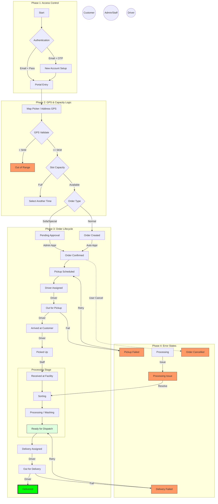

# Vastra Express - Client User Manual

Welcome to the **Vastra Express** Client User Manual. This document provides a comprehensive guide on how to navigate and manage the entire laundry ecosystem, from the Administrator's high-level oversight to the Customer's order placement.

---

## 1. Portal Access (Vercel Links)

The platform is divided into four main portals, each tailored for a specific user role.

| Portal | URL | Description |
| :--- | :--- | :--- |
| **Admin Portal** | [https://vastra-express-admin.vercel.app/](https://vastra-express-admin.vercel.app/) | Core management, master data, and analytics. |
| **Facility Portal** | [https://vastra-express-facility.vercel.app/](https://vastra-express-facility.vercel.app/) | Operational workflow for washing, sorting, and processing. |
| **Customer Web** | [https://vastra-express-customer.vercel.app/](https://vastra-express-customer.vercel.app/) | User portal for booking and tracking laundry orders. |
| **Driver Web** | [https://vastra-express-driver.vercel.app/](https://vastra-express-driver.vercel.app/) | Task management for pickups and deliveries. |

---

## 2. Authentication & Login

The system uses a secure email-based authentication flow. **Mobile-based OTP login has been discontinued.**

### 2.1 For Customers & Staff
- **Registration**: New users register using their **Email Address**. A 6-digit OTP is sent to the email for verification.
- **Login**: Existing users log in using their **Email and Password**.
- **Password Management**: Staff members created by an Admin will be prompted to set a permanent password upon their first login.

### 2.2 For Administrators
- **Username**: `admin`
- **Password**: `password`
> [!IMPORTANT]
> Admin credentials use a secure username/password combination. Change your password immediately after first login via the Profile settings.

---

## 3. GPS & Location System (Core Logic)

Vastra Express relies heavily on GPS coordinates (Latitude & Longitude) to automate operations and ensure efficiency.

### 3.1 How GPS Works
The system uses the **Haversine Formula** to calculate the "as-the-crow-flies" distance between a customer and a facility.

- **Maximum Service Radius**: The system only allows bookings if a customer is within **5 KM** of an active facility.
- **Bounding Box Search**: When a customer books, the system creates a virtual "search square" around their location to quickly find nearby facilities.
- **Allocation Logic**: If multiple facilities are within range, the system prioritizes:
    1. **Shortest Distance**: The closest facility is picked first.
    2. **Lowest Load**: If distances are equal, the facility with the fewest current bookings is selected.

---

## 4. Operational System Diagram

The following diagram represents the **Analyzed System Architecture**, reflecting real-world logic, state transitions, and role-based permissions.

---

## 5. Administrator Guide

### 5.1 Setting Up Operations

#### Step 1: Add Cities
Navigate to **Settings** > **City Management**. Master cities must exist before facilities can be assigned.

#### Step 2: Add a Facility (GPS Required)
Navigate to **Facilities** > **Add Facility**.
- **GPS Coordinates**: You **must** enter the exact Latitude and Longitude of the facility.
- **Facility Code**: A unique identifier (e.g., `MUM_WEST_01`).

#### Step 3: Create & Assign Staff
1. Navigate to **User Management** > **Staff**.
2. Create the user with their **Email**.
3. **Link to Facility**: Assign them to a specific facility to restrict their operational view.

---

## 6. Facility Management

Facility staff handle the **Processing** lifecycle.

### 6.1 Order Processing
- All orders in the facility are unified under the "**Processing**" workflow.
- Staff move orders through stages: `RECEIVED_AT_FACILITY` → `PROCESSING` → `READY_FOR_DISPATCH`.
- **GPS Tracking**: Admins can see the distance of every order from the facility in the dashboard.

---

## 7. The Customer Experience

### 7.1 Booking an Order
1. **Login**: Use Email and Password.
2. **Add Address (GPS)**: Captured via a map picker. Serviceability is checked instantly.
3. **Select Slot**: Pick an available time window.
4. **Processing**: All orders are submitted for standard **Processing**.
5. **Confirm**: Submit and track.

---

## 8. Driver Workflow

Drivers use the Web/Mobile app to manage tasks.
- **GPS Navigation**: Direct links to maps for customer locations.
- **Status Updates**: Mark tasks as `ARRIVED`, `PICKED_UP`, or `DELIVERED`.

---

## 9. Troubleshooting & FAQ

- **"Service Not Available" Message?**
  The customer's GPS location is more than 5 KM away from the nearest active facility.
- **Email OTP Not Arriving?**
  Check the spam folder. Ensure the email entered is correct.
- **GPS Coordinates Incorrect?**
  Admins can update facility coordinates in the Facility Management section.
