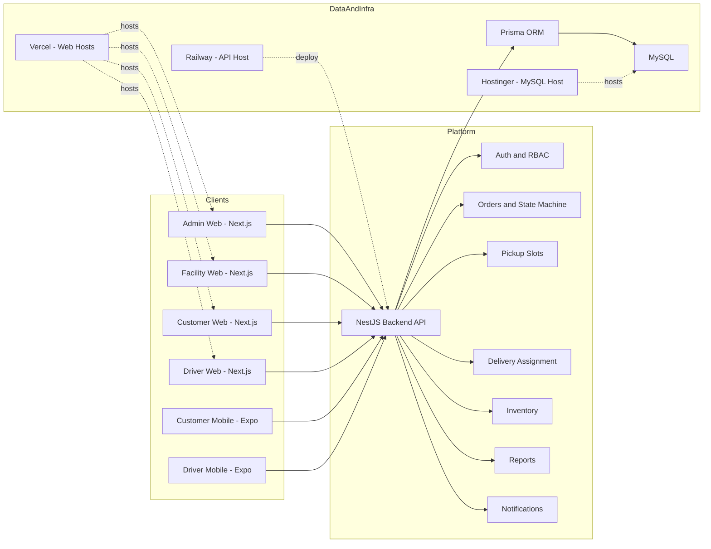
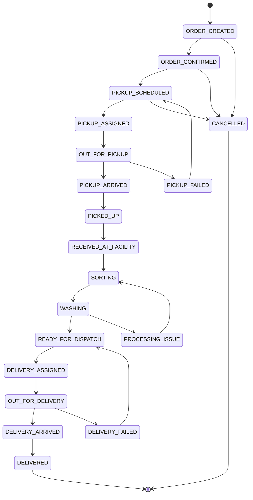
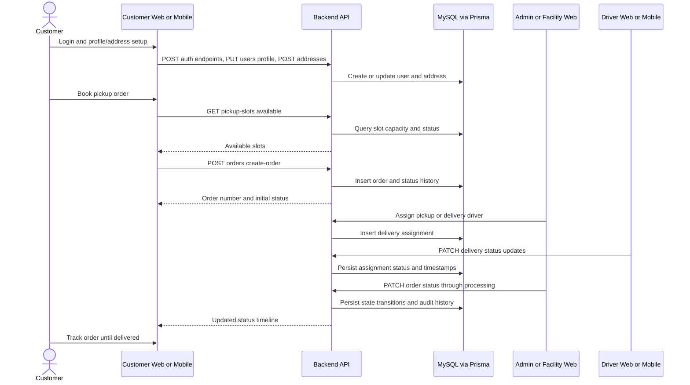

# Vastra Express Documentation Review - Pack 1

Document Date: 18 April 2026
Scope: UML diagrams, screen design and validations, reporting coverage (analytical and graphical), and current documentation review findings.

---

## 1. Documentation Review Summary

### 1.1 Existing Documentation Already Available

| Document | Purpose | Current Usefulness |
|---|---|---|
| README.md | Monorepo overview, apps, V2 scope | Good high-level orientation |
| IMPLEMENTATION_GUIDE.md | Architecture, entities, phased implementation plan | Strong technical planning reference |
| CLIENT_BETA_HANDOVER.md | URLs, beta scope, UAT prerequisites, known constraints | Good client handover baseline |
| V2_MIGRATION_GUIDE.md | V2 module removals and active scope | Useful change context |
| vastra-express-facility/PRESENTATION_BRIEF.md | Product narrative and architecture summary | Good presentation support |
| vastra-express-customer-web/UI_IMPROVEMENTS_SUMMARY.md | UI changes and design rationale | Useful UI history |

### 1.2 Documentation Gaps Identified

1. No consolidated UML packet covering component, use-case, sequence, and state views.
2. No formal screen specification that links each screen to user role, key inputs, API dependencies, and validation behavior.
3. No single reporting specification connecting backend report APIs to actual chart widgets used by web clients.
4. No formal UAT test case document with stable test data.
5. No complete role-wise user manual with repeatable operational steps.

---

## 2. UML Diagrams (Applicable)

### 2.1 System Component Diagram

### 2.2 Role Use-Case Diagram

```mermaid
flowchart TB
    Customer((Customer))
    Driver((Driver))
    Facility((Facility Staff))
    Admin((Admin))

    UC1[Login or OTP Verify]
    UC2[Manage Address]
    UC3[Book Pickup Order]
    UC4[Track Order Status]

    UD1[View Assigned Pickups]
    UD2[View Assigned Deliveries]
    UD3[Update Assignment Status]

    UF1[View Facility Orders]
    UF2[Advance Processing Status]
    UF3[Manage Facility Slots]
    UF4[Monitor Inventory]
    UF5[View Facility Reports]

    UA1[Manage Users and Roles]
    UA2[Manage Cities and Facilities]
    UA3[Manage Slots]
    UA4[Assign Drivers]
    UA5[Monitor Deliveries]
    UA6[View Analytics Reports]

    Customer --> UC1
    Customer --> UC2
    Customer --> UC3
    Customer --> UC4

    Driver --> UC1
    Driver --> UD1
    Driver --> UD2
    Driver --> UD3

    Facility --> UC1
    Facility --> UF1
    Facility --> UF2
    Facility --> UF3
    Facility --> UF4
    Facility --> UF5

    Admin --> UC1
    Admin --> UA1
    Admin --> UA2
    Admin --> UA3
    Admin --> UA4
    Admin --> UA5
    Admin --> UA6
```

### 2.3 Order Lifecycle State Diagram (Operational View)

Note:
- Historical and test references still mention intermediary states like IRONING, PACKING, BILL_GENERATED in some parts of the codebase and docs.
- V2 operational flow used in handover documents converges processing to READY_FOR_DISPATCH.

### 2.4 Sequence Diagram: Customer Booking to Delivery Completion

---

## 3. Screen Design and Validations

### 3.1 Screen Inventory by Application

#### A. Admin Web

| Screen Route | Functional Goal | Main Actions |
|---|---|---|
| /login | Admin authentication | Username and password login |
| / | Dashboard overview | KPI view, quick navigation |
| /orders | Order monitoring | Filter, paginate, open order detail |
| /orders/[id] | Order detail and control | Status view, assignment actions |
| /delivery | Assignment monitoring | Filter by status, inspect driver tasks |
| /users | Staff and role management | Add staff, change role, activate or deactivate |
| /inventory | Inventory control | Add item, log transactions, low-stock view |
| /slots | Slot operations | Create, edit, delete, toggle, block or unblock day |
| /settings | Master data | Profile update, city and facility management |
| /reports | Reporting dashboard | Date range analytics, chart views, driver table |

#### B. Facility Web

| Screen Route | Functional Goal | Main Actions |
|---|---|---|
| /login | Facility staff login | Mobile check, first-time setup, password login |
| / | Facility dashboard | Facility KPIs and navigation |
| /orders | Facility order pipeline | Move orders through processing stages |
| /delivery | Facility dispatch visibility | Track outbound assignments |
| /inventory | Inventory operations | Monitor stock and low-stock conditions |
| /slots | Facility slot governance | Daily slot block and unblock control |
| /reports | Facility analytics | KPI cards, status charts, service distribution |
| /profile | Staff profile | Account and personal details |

#### C. Customer Web

| Screen Route | Functional Goal | Main Actions |
|---|---|---|
| / | Landing page | Explore service, pricing, onboarding |
| /pricing | Pricing catalog explorer | Search, filter by category and range |
| /login | OTP login | Send OTP, verify OTP |
| /register | First profile completion | Set name and optional email |
| /dashboard | Customer home | View recent and active orders |
| /book | Order booking wizard | Choose address, slot, service, notes |
| /addresses | Address management | Add, edit, delete, set default |
| /orders | Order list and tracking | Browse and inspect orders |
| /orders/[id] | Detailed order timeline | View full progress history |
| /profile | Profile settings | Update profile attributes |

#### D. Driver Web

| Screen Route | Functional Goal | Main Actions |
|---|---|---|
| /login | Driver authentication | Mobile OTP flow |
| / | Driver dashboard | Assignment summary |
| /pickups | Pickup task list | Open and update pickup tasks |
| /pickups/[id] | Pickup detail | Update pickup assignment progress |
| /deliveries | Delivery task list | Open and update delivery tasks |
| /deliveries/[id] | Delivery detail | Mark in-progress, arrived, complete, failed |
| /profile | Driver account view | Profile and basic settings |

#### E. Customer Mobile (Expo)

| Screen | Functional Goal |
|---|---|
| app/(auth)/login | Mobile OTP login |
| app/(auth)/otp | OTP verification |
| app/(auth)/register | First-time profile setup |
| app/(tabs)/home | Dashboard and quick actions |
| app/(tabs)/orders | Order listing |
| app/order/new | New order booking |
| app/order/[id] | Order details and status |
| app/addresses/index and app/addresses/add | Address management |
| app/(tabs)/profile and app/profile/edit | Profile maintenance |

#### F. Driver Mobile (Expo)

| Screen | Functional Goal |
|---|---|
| app/(auth)/login | Driver sign-in |
| app/(auth)/otp | OTP verification |
| app/(tabs)/home | Dashboard |
| app/(tabs)/pickups | Pickup task queue |
| app/(tabs)/deliveries | Delivery task queue |
| app/task/[id] | Task detail and status update |
| app/(tabs)/profile | Driver profile |

### 3.2 Validation Matrix (UI and API)

| Domain | Validation Rule | Enforced In UI | Enforced In API |
|---|---|---|---|
| Mobile number | 10-digit Indian number; starts 6-9 in customer OTP flows | Yes | Yes |
| OTP | Numeric, exact 6 digits for verify endpoints | Yes | Yes |
| Staff password | Minimum length 8 | Yes | Yes |
| Name | 2-100 chars; letters, spaces, apostrophe, hyphen | Yes | Yes |
| Email | Standard email format if provided | Yes | Yes |
| Address pincode | Exactly 6 digits | Yes | Yes |
| Create order IDs | addressId and pickupSlotId positive integers | Partial | Yes |
| Service type | Enum value only | Yes | Yes |
| Customer notes | Max 500 chars | UI length control and API guard | Yes |
| Slot date | Valid date format | Browser date input | Yes |
| Slot time | HH:MM 24-hour format | Browser time input | Yes |
| Slot capacity | Minimum 1 | Yes | Yes |
| Inventory quantity | Numeric, max 2 decimals, non-negative | Yes | Yes |
| Assignment type | PICKUP or DELIVERY only | Controlled UI selection | Yes |
| Assignment IDs | Positive integers | Partial | Yes |

### 3.3 Backend DTO-Level Validation Catalog

| Endpoint Area | DTO | Key Validations |
|---|---|---|
| Auth | send-otp | mobile regex and optional expectedRole |
| Auth | verify-otp | mobile regex, OTP 6-digit, optional validated name |
| Auth | staff-check | 10-digit mobile |
| Auth | staff-setup | 10-digit mobile, min 8-char password |
| Auth | staff-login | 10-digit mobile, required password |
| Users | create-staff | mobile regex, name regex and length, role enum, optional email |
| Addresses | create-address | length limits, pincode regex, cityId integer, optional isDefault |
| Addresses | update-address | partial with same constraints |
| Orders | create-order | positive IDs, service enum, optional boolean isExpress, notes length |
| Pickup Slots | create-slot | date validity, HH:MM time, capacity min 1 |
| Delivery | assign-driver | positive IDs, assignment type enum |
| Inventory | create-item and log-transaction | category enum, non-negative quantity, decimal precision |

### 3.4 Database Integrity Constraints Relevant to Validation

1. users.mobile_number is unique.
2. users.customer_id is unique.
3. facilities.facility_code is unique.
4. pickup_slots has unique composite key on facilityId + slotDate + startTime.
5. orders table has indexes on customerId, currentStatus, facilityId, createdAt.

---

## 4. Reports - Analytical and Graphical

### 4.1 Backend Report APIs and Analytical Outputs

| Endpoint | Access Role | Analytical Output |
|---|---|---|
| GET /api/reports/dashboard | ADMIN | todayOrders, totalCustomers, pendingDeliveries, activeFacilities, ordersByStatus, ordersByServiceType, last-7-day order trends, facility-wise day trends |
| GET /api/reports/orders | ADMIN and FACILITY_STAFF | period summary, ordersByStatus, ordersByServiceType, dailyOrders, expressVsStandard |
| GET /api/reports/drivers | ADMIN | per-driver totals, completed, failed, inProgress, successRate |
| GET /api/reports/facilities | ADMIN | per-facility orders in selected date range |

### 4.2 Graphical Reporting Implemented in Web Apps

#### Admin Reports UI

1. Orders by Service Type - vertical bar chart.
2. Orders by Status - horizontal bar chart.
3. Daily Order Volume - line chart.
4. Driver performance - tabular grid with success-rate progress bars.
5. Optional revenue-by-payment pie chart component exists, but no active revenue payload from current reports APIs.

#### Facility Reports UI

1. KPI cards for todays orders, monthly revenue, pending deliveries, and orders processed.
2. Revenue chart (bar chart) expected in last-30-days form.
3. Orders by Processing Stage as pie chart.
4. Orders by Service Type as bar chart.
5. Status breakdown as tabular share analysis.

### 4.3 Report Filters and Access Rules

1. Date-range filters are available on admin reports.
2. Reports controller defaults date range to month-start through current date when not supplied.
3. Facility staff are automatically scope-restricted to their own facility for order analytics endpoint.
4. Driver and facility performance endpoints remain admin-only.

### 4.4 Current Report Contract and Data-Model Mismatches (Important)

1. Admin reports page maps dailyVolume from ordRaw.dailyRevenue, but the API currently returns dailyOrders.
2. Facility reports page expects monthlyRevenue, revenueByDay, and totalProcessed fields that are not produced by current backend reports/dashboard payload.
3. Facility frontend DashboardSummary type still contains activeSubscriptions and monthlyRevenue fields not provided by backend dashboard response.

Impact:
- Graph sections may render empty or zeroed values unless frontend mapping is aligned to current API shape.

---

## 5. Additional Cross-Module Findings Affecting Documentation and Testing

1. Service type mismatch: customer-web type allows WASH_IRON while backend ServiceType enum currently allows WASH_FOLD, DRY_CLEAN, IRON_ONLY only.
2. Order status references differ between some tests/docs and current enum file (for example BILL_GENERATED and REFUND_INITIATED appear in tests/docs but not in current enum file).
3. App-level README files for admin and facility are still default boilerplate and do not describe actual module behavior.

---

## 6. Recommendations

1. Freeze a canonical contract document for report payloads and regenerate frontend types from it.
2. Harmonize service-type enum definitions across backend and all clients before UAT.
3. Publish one source-of-truth order-status matrix and align enum, tests, and handover guides.
4. Replace boilerplate app READMEs with role-specific quick operation manuals.
5. Keep this document as the technical baseline and pair it with Pack 2 for execution-level testing and user operations.
