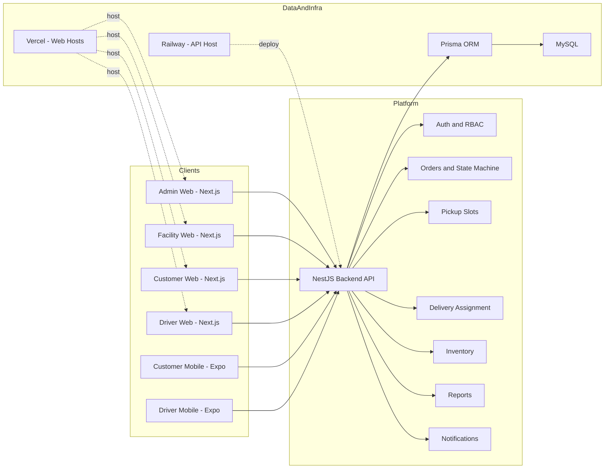
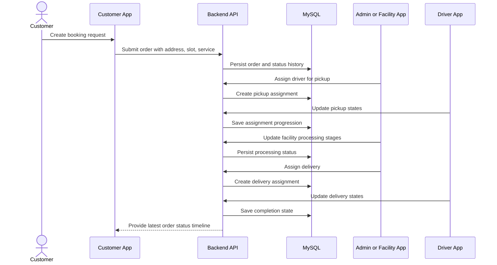
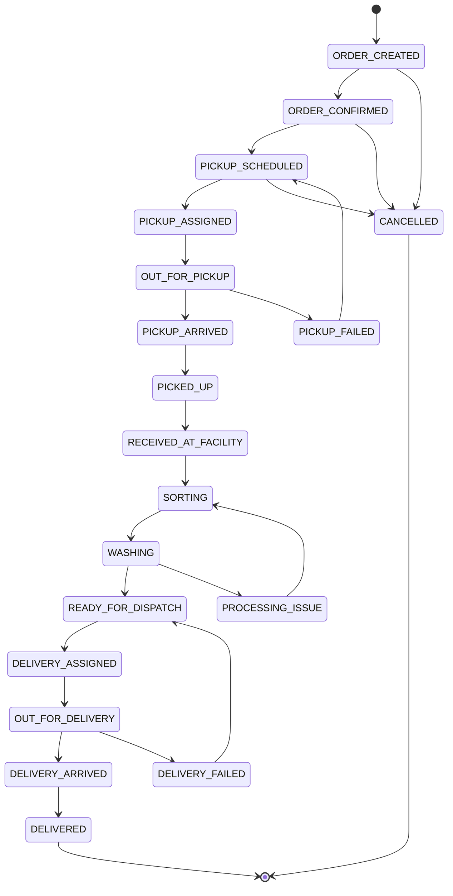

# Vastra Express - System Design and Validation Document

Prepared Date: 18 April 2026
Purpose: Presentation-ready technical and functional document based on the requested content list.

---

## 1. Problem Statement

Traditional laundry systems are typically:
- Manual and unorganized
- Missing real-time order tracking
- Inefficient in pickup and delivery coordination
- Weak in customer experience and status transparency

### Goal
Build a scalable digital platform that supports:
- Order booking
- Laundry processing lifecycle management
- Delivery tracking
- Multi-role operational management

---

## 2. Solution Overview

Vastra Express is designed as a multi-platform system:
- Web applications for Admin, Facility, Customer, and Driver
- Mobile applications for Customer and Driver

### Core Capabilities
- Online order booking
- Real-time order tracking
- Role-based dashboards
- Analytics and reporting

---

## 3. System Architecture

### Component Diagram

### Architecture Explanation
- Frontend stack: Next.js for web portals and Expo for mobile apps
- Backend stack: NestJS REST API with modular domain services
- ORM: Prisma for typed data access and schema-driven migrations
- Database: MySQL
- Hosting model: Web apps on Vercel, API on Railway

### Key Architecture Point
Centralized API with modular services architecture.

---

## 4. User Roles and Access

### Customer
- Book laundry orders
- Track real-time status

### Driver
- Execute pickup and delivery assignments
- Update assignment progress

### Facility Staff
- Process orders through laundry workflow stages
- Manage local operational actions

### Admin
- Full system oversight and control
- Access analytics and reporting

### Access Control Model
Role-based access is implemented using RBAC.

---

## 5. Order Flow (End-to-End)

### Sequence Diagram

### Flow Summary
- Customer books order
- Slot is allocated
- Driver performs pickup
- Facility performs processing stages
- Delivery is assigned
- Order is delivered

### Highlight
Real-time status updates are propagated through centralized status and assignment updates.

---

## 6. Order State Machine

### State Diagram

### Key Points
- Structured lifecycle with explicit states
- Controlled transitions by role and context
- Failure handling paths for pickup failed and delivery failed

Important statement:
"Invalid transitions are blocked at backend level"

---

## 7. Core Modules

### 1) Orders Module
- Create order
- Track order timeline
- Update order status through controlled transitions

### 2) Slot Management Module
- Capacity-based scheduling
- Slot availability control by date and facility

### 3) Delivery Assignment Module
- Driver-task linking for pickup and delivery
- Assignment status progression and tracking

### 4) Inventory System Module
- Stock tracking by facility
- Low-stock alert support

---

## 8. Reporting and Analytics

### Admin Reporting Views
- Orders by status
- Orders by service type
- Daily trend views

### Facility Reporting Views
- Processing-stage statistics
- Operational performance views

Important evaluator statement:
"Reporting layer exists but has contract mismatch issues"

---

## 9. Key Findings and Issues

These were identified during system validation phase.

### High Severity
1. Reports API mismatch:
- UI expects dailyRevenue
- API currently returns dailyOrders

2. Service type mismatch:
- Frontend includes WASH_IRON
- Backend does not support WASH_IRON in current enum

### Medium Severity
- Order status inconsistency across modules and artifacts

### Low Severity
- Missing role-specific README and operational documentation in some app folders

---

## 10. Validation and Data Integrity

### Input Validations
- Mobile number format checks
- OTP format checks
- Email format checks
- Pincode format checks

### Backend Enforcement
- DTO-based validation rules
- Enum-based request enforcement

### Database Constraints
- Unique mobile number
- Unique facility code
- Unique slot key by facility and time combination

---

## 11. Testing Strategy

### Test Types
- Functional testing
- Negative testing
- Security testing
- Regression testing

### Example Cases
- Invalid service type is rejected
- Unauthorized access is blocked

### Test Execution Approach
Structured test cases are documented with priority, test data, and expected results.

---

## 12. UI and Screen Design Coverage

### Covered Interfaces
- Admin dashboard and controls
- Facility operations interface
- Customer booking and tracking flow
- Driver task execution interface

### UI Highlights
- Clean role-specific user interfaces
- Validation controls at both UI layer and API layer

---

## 13. Security Features

- OTP-based authentication
- JWT authorization
- Role-based access control
- Protected API endpoints

---

## 14. Unique Features

- Multi-role digital ecosystem
- End-to-end order lifecycle tracking
- Slot-based scheduling and capacity control
- Real-time driver status updates
- Scalable modular architecture

---

## 15. Limitations

- Reporting data contract mismatch (revenue-specific fields incomplete)
- Service enum inconsistency between frontend and backend
- Some UI assumptions not fully backed by API payloads

---

## 16. Future Enhancements

- Revenue analytics integration
- AI-based demand prediction
- Driver route optimization
- Notification expansion (SMS and WhatsApp)
- Payment integration

---

## 17. Conclusion

The project successfully demonstrates a full-stack, scalable, multi-role operational platform for laundry logistics.

It covers:
- Architecture
- Workflow execution
- Validation and integrity controls
- Test strategy and observed gaps

End statement:
"This project reflects both system design and practical implementation challenges."

---

## 18. Test Cases and Test Data Appendix

### 18.1 Master Test Data Set

| Entity | Field | Value 1 | Value 2 | Purpose |
|---|---|---|---|---|
| City | id, name, state | 1, Mumbai, Maharashtra | 2, Bengaluru, Karnataka | Master setup for addresses and facilities |
| Facility | id, code, name, cityId | 1, MUM_CENTRAL_01, Mumbai Central Facility, 1 | 2, BLR_SOUTH_01, Bengaluru South Facility, 2 | Facility-scoped operations |
| Admin User | username, password | admin_main, Admin@123 | - | Admin authentication |
| Facility Staff | mobile, name, role, facilityId | 9000000002, Facility One, FACILITY_STAFF, 1 | 9000000012, Facility Two, FACILITY_STAFF, 2 | Facility workflows |
| Driver | mobile, name, role | 9000000003, Driver One, DRIVER | 9000000013, Driver Two, DRIVER | Pickup and delivery execution |
| Customer | mobile, name, role | 9000000004, Customer One, CUSTOMER | 9000000014, Customer Two, CUSTOMER | Booking and tracking |
| Address | id, userId, pincode, cityId | 101, Customer One, 400053, 1 | 102, Customer Two, 560102, 2 | Order booking inputs |
| Slot | id, facilityId, date, start, end, capacity | 501, 1, 2026-04-20, 09:00, 11:00, 20 | 502, 1, 2026-04-20, 11:00, 13:00, 20 | Slot booking tests |
| Inventory Item | id, facilityId, item, category, qty, threshold | 701, 1, Ariel Detergent, DETERGENT, 50, 5 | 702, 1, Laundry Bags, PACKAGING, 100, 20 | Inventory and low-stock tests |

### 18.2 Valid Input Data Samples

| Module | Field | Sample Valid Data |
|---|---|---|
| Auth | mobileNumber | 9876543210 |
| Auth | otp | 123456 |
| Profile | name | Rahul Sharma |
| Profile | email | rahul.sharma@example.com |
| Address | pincode | 400053 |
| Slot | startTime, endTime | 09:00, 11:00 |
| Orders | serviceType | WASH_FOLD, DRY_CLEAN, IRON_ONLY |
| Orders | customerNotes | Please separate white clothes |
| Delivery | assignmentType | PICKUP or DELIVERY |
| Inventory | category | DETERGENT, PACKAGING, TAG, MACHINERY, MISC |

### 18.3 Invalid Data Set for Negative Testing

| Module | Field | Invalid Data | Expected Validation Outcome |
|---|---|---|---|
| Auth | mobileNumber | 12345 | Rejected as invalid mobile format |
| Auth | otp | 12A45 | Rejected as non-numeric OTP |
| Profile | name | Test123 | Rejected by name pattern |
| Profile | email | user@invalid | Rejected by email validation |
| Address | pincode | 4005 | Rejected as non-6-digit pincode |
| Slot | time | 25:30 | Rejected as invalid HH:MM |
| Orders | serviceType | WASH_IRON | Rejected by backend enum |
| Orders | addressId | 0 | Rejected by minimum constraint |
| Inventory | quantity | -2 | Rejected by non-negative rule |
| Reports | facilityId query | abc | Rejected as invalid integer |

### 18.4 Test Case Matrix

| TC ID | Type | Priority | Scenario | Precondition | Test Data | Expected Result |
|---|---|---|---|---|---|---|
| AUTH-001 | Functional | High | Send OTP with valid mobile | User exists or allowed to register | mobile 9000000004 | OTP send success response |
| AUTH-002 | Negative | High | Send OTP with invalid mobile | None | mobile 12345 | Validation error |
| AUTH-003 | Functional | High | Verify OTP with valid data | OTP already generated | mobile 9000000004, otp 123456 | JWT issued and profile returned |
| AUTH-004 | Negative | High | Verify OTP with wrong OTP | OTP generated | otp 999999 | Invalid OTP error |
| AUTH-005 | Security | High | Access protected endpoint without token | None | no Authorization header | 401 Unauthorized |
| AUTH-006 | Functional | High | Facility first-time setup | Staff account exists and setup pending | mobile 9000000002, otp valid, password StrongPass1 | Password set and login success |
| AUTH-007 | Negative | Medium | Staff setup with short password | Setup flow active | password 1234567 | Validation error |
| CUST-001 | Functional | High | Save customer profile | Customer authenticated | name Customer One, email customer1@example.com | Profile updated successfully |
| CUST-002 | Negative | Medium | Save profile with invalid name | Customer authenticated | name Test123 | Validation error |
| ADDR-001 | Functional | High | Create address | Customer authenticated | pincode 400053, cityId 1 | Address created |
| ADDR-002 | Negative | High | Create address with bad pincode | Customer authenticated | pincode 4005 | Validation error |
| SLOT-001 | Functional | High | Create slot | Admin authenticated | facilityId 1, date 2026-04-20, 09:00-11:00 | Slot created |
| SLOT-002 | Negative | High | Create duplicate slot | Matching slot already exists | same facility and date and startTime | Unique constraint conflict |
| SLOT-003 | Negative | Medium | Create slot with invalid time | Admin authenticated | startTime 25:30 | Validation error |
| SLOT-004 | Functional | Medium | Block day operation | Admin and slots exist | facilityId 1, date 2026-04-20, block true | Slots deactivated for that date |
| ORD-001 | Functional | High | Create order with valid payload | Address and slot exist | addressId 101, pickupSlotId 501, serviceType WASH_FOLD | Order created |
| ORD-002 | Negative | High | Create order with unsupported service type | Address and slot exist | serviceType WASH_IRON | Rejected by backend enum |
| ORD-003 | Negative | High | Invalid state transition skip | Existing order in ORDER_CREATED | transition ORDER_CREATED to PICKED_UP | Transition blocked |
| ORD-004 | Functional | Medium | Customer cancel before pickup | Order in ORDER_CONFIRMED | role CUSTOMER to CANCELLED | Cancellation accepted |
| ORD-005 | Negative | Medium | Customer cancel after pickup started | Order in OUT_FOR_PICKUP | role CUSTOMER to CANCELLED | Cancellation rejected |
| DEL-001 | Functional | High | Assign driver for pickup | Order exists | orderId valid, driverId valid, type PICKUP | Assignment created |
| DEL-002 | Functional | High | Driver status update progression | Assignment in ASSIGNED | IN_PROGRESS then ARRIVED then COMPLETED | Status updates accepted |
| DEL-003 | Negative | Medium | Invalid delivery status update | Assignment exists | status INVALID_STATE | Request rejected or guarded |
| INV-001 | Functional | High | Add inventory item | Facility exists | item Ariel, qty 50, category DETERGENT | Item created |
| INV-002 | Negative | High | Add inventory with negative quantity | Facility exists | quantity -1 | Validation error |
| INV-003 | Functional | Medium | Consume inventory and verify log | Inventory item exists | quantityChange -2.5 | Balance and log updated |
| REP-001 | Functional | High | Admin dashboard report fetch | Admin authenticated | GET reports/dashboard | KPI payload returned |
| REP-002 | Security | High | Facility user tries admin-only driver report | Facility staff authenticated | GET reports/drivers | Forbidden |
| REP-003 | Functional | Medium | Facility report scope check | Facility staff authenticated | reports/orders with another facilityId | Data restricted to own facility |
| REP-004 | Regression | Medium | Validate report contract consistency | UI and API connected | UI expects dailyRevenue, API provides dailyOrders | Mismatch identified and logged |
| SEC-001 | Security | High | Role-restricted endpoint access | Customer authenticated | customer token on admin users endpoint | Forbidden |
| SEC-002 | Security | Medium | Invalid token usage | None | tampered JWT | Unauthorized response |
| SEC-003 | Security | Medium | OTP brute-force attempt | OTP flow active | multiple invalid OTP submissions | Repeated attempts rejected |

### 18.5 Suggested Execution Buckets

| Bucket | Included Cases | Goal |
|---|---|---|
| Smoke | AUTH-001, AUTH-003, ORD-001, DEL-001, REP-001 | Quick readiness validation |
| Core Functional | CUST-001, ADDR-001, SLOT-001, DEL-002, INV-001 | Business flow confidence |
| Negative | AUTH-002, ADDR-002, SLOT-002, ORD-002, INV-002 | Validation robustness |
| Security | AUTH-005, REP-002, SEC-001, SEC-002, SEC-003 | Access and token security |
| Regression | ORD-003, ORD-005, REP-004 | Stability against known risk areas |

### 18.6 UAT Result Logging Template

| Field | Example |
|---|---|
| Test Case ID | ORD-002 |
| Tester | QA-01 |
| Build Version | Beta 2026-04-18 |
| Module | Orders |
| Input Data | serviceType WASH_IRON |
| Actual Result | 400 Bad Request |
| Expected Result | Unsupported enum rejection |
| Status | Pass |
| Defect ID | NA |

